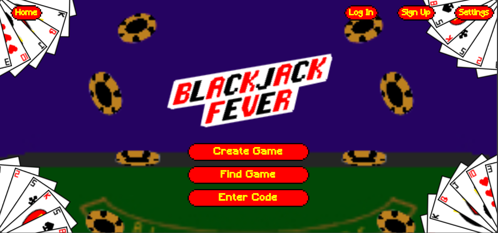
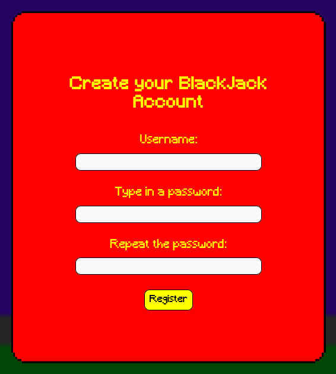
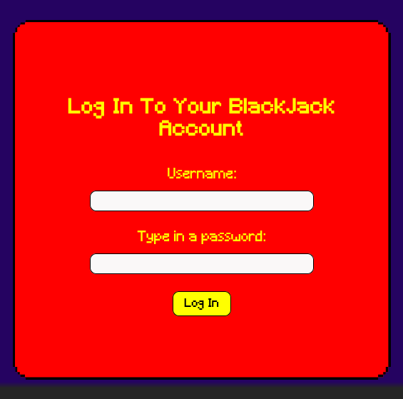
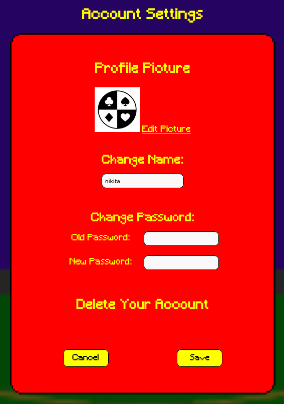
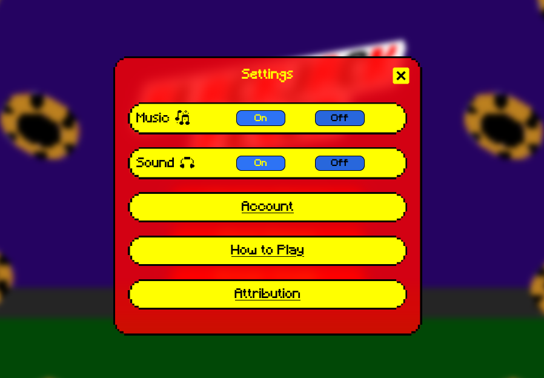
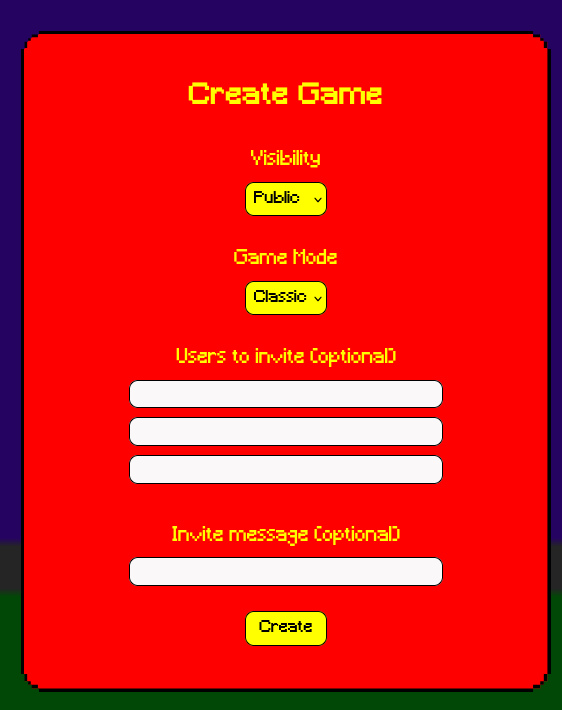
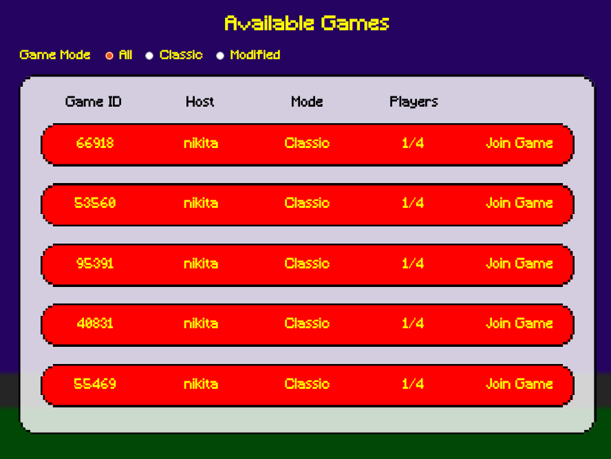
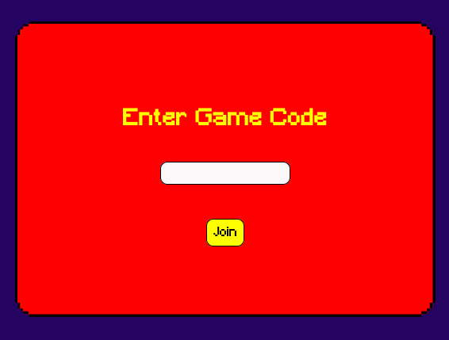
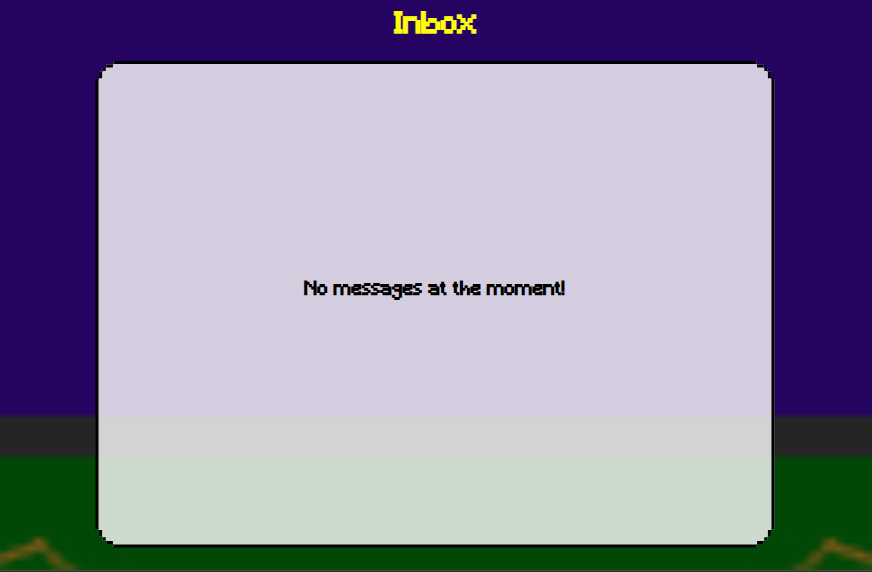
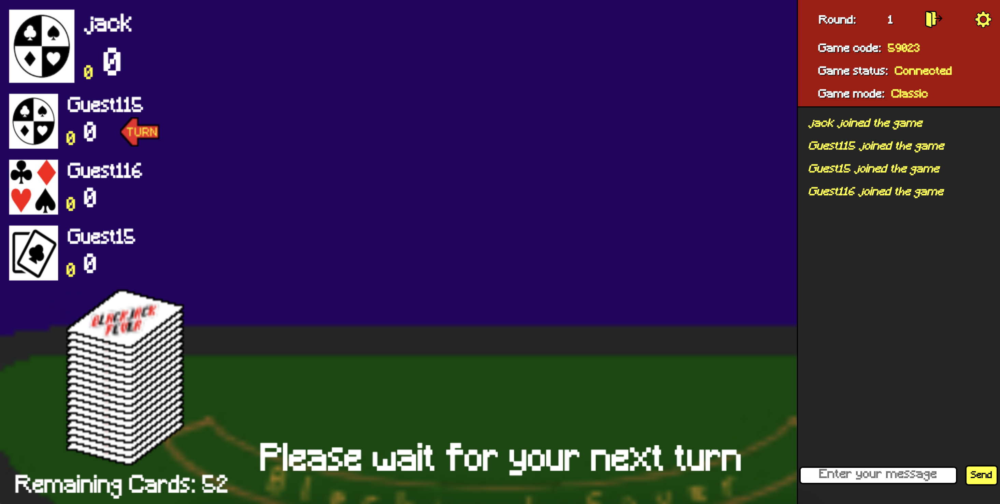

# Documentation

Here in the documentation we'll cover
- Features
    - Login/ Sign-up
    - Account and Settings
    - Creating/ Joining a game
- How to play
    - Basics of blackjack
    - Blackjack Fever

## Features

### Login/ Sign-up

In the top right corner of the home screen you will see two buttons beside the settings option, login or sign up

The login and sign up pages will look like this

From here, simply create an account or enter the credentials of an account that you have already made

### Account and Settings

If you click on the button in the top left of the menu, you'll be brought to the account settings page as seen below

From here you can change/ upload a new profile picture, change your name, change your password or delete your account. 

There is also a more general settings bar in the top right where you can toggle music and sounds

### Creating/ Joining a Game

On the main menu you will see 3 options, Create Game, Join Game and Enter Code.

When clicking "Create Game" you will see the page shown below

Insert the details as prompted to create the game, from here you can also invite users, allowing them to join your game directly through their inbox. 

You have 3 choices to find your game
- Finding the game through the "Find Game" button
- Entering the code specific to the game through the "Enter Game" button
- Entering the game through your inbox

The three screens look like this:

## How to Play

### The Basics of blackjack

In blackjack, the person who gets the score closest to 21 without going over it, wins. Your score corresponds to the value of the cards your dealt, E.G. If you have a 9 of Clubs and a 5 of Diamonds your total score is 14

Players will "Hit" to get another card and "Stand" to show they are happy with their score

A classic game of blackjack consists of 5 rounds in which the winner of the majority of the rounds wins overall

### Blackjack Fever

With the Modified/ Fever element to our game, we shake things up by including "special cards", these are golden cards that when drawn will either add or subtract from every other players total, adding an extra layer of player interaction to Blackjack!

Thank you for reading and we hope you enjoy!
- Team 7